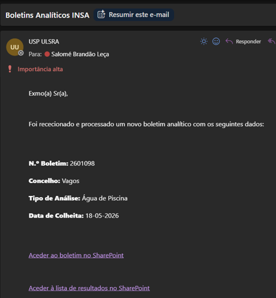

```{=html}
<div class="manual-title-row">
  <div class="manual-title-text">
    <h1 class="manual-title">Sistemas de Informação em Saúde Pública<br>| USP Baixo Vouga</h1>
    <p class="manual-subtitle">Manual Orientador</p>
  </div>
  
</div>
<div class="manual-meta-box">
  <span>👤 Autor: S. Leça</span>
  <span>📅 Criado em: 22 de junho de 2026</span>
  <span>🔄 Última atualização: <span id="last-updated"></span></span>
</div>
<script>
  const d = new Date(document.lastModified);
  const opts = { day: '2-digit', month: 'long', year: 'numeric' };
  document.getElementById('last-updated').textContent = d.toLocaleDateString('pt-PT', opts);
</script>
<hr/>
```

## Introdução {#sec-intro}

O projeto de intervenção **"Sistemas de Informação em Saúde Pública | USP Baixo Vouga"** visa a automatização de processos administrativos morosos e de reduzido valor acrescentado. O objetivo é otimizar a gestão do tempo dos profissionais da USP, permitindo a realocação do tempo libertado para funções e tarefas essenciais e de valor acrescentado para a prática em Saúde Pública. Paralelamente, este projeto corre em estreito alinhamento com o processo de certificação e melhoria contínua da USP.

Este manual atua como um guia de consulta para a transição e adaptação aos novos fluxos de trabalho. O link dá acesso à versão mais atualizada do manual, enquanto que os ficheiros em PDF e HTML serão enviados via email apenas perante atualizações substanciais aos procedimentos.

## Programa de Vigilância Sanitária das Águas {#sec-pvsa}

Encontramo-nos na fase de implementação do sistema de processamento automático dos boletins analíticos emitidos pelo INSA. A arquitetura deste sistema recorre ao **Power Automate** e ao **AI Builder** para ler os ficheiros PDF, extrair os resultados analíticos e registá-los de forma autónoma nas listas do SharePoint.

Durante a atual fase de testes, a validação rigorosa de todos os campos e a notificação de eventuais anomalias pelas equipas assumem um caráter crítico.

### O que muda com este sistema? {#sec-mudancas}

```{=html}
<table class="comparison-table">
  <thead>
    <tr>
      <th>⚠️ Processo Anterior (Manual)</th>
      <th>✅ Novo Processo (Automatizado)</th>
    </tr>
  </thead>
  <tbody>
    <tr>
      <td>
        <ol>
          <li>Receção do PDF com os resultados pela equipa gestora, via e-mail;</li>
          <li>Encaminhamento do PDF para a equipa local (EL);</li>
          <li>Abertura do ficheiro de resultados e inserção manual de cada parâmetro no Excel;</li>
          <li>Arquivo manual do documento PDF na pasta local respetiva.</li>
        </ol>
      </td>
      <td>
        <ol>
          <li>Processamento automático do e-mail proveniente do INSA;</li>
          <li>Extração estruturada de dados do boletim através do modelo de inteligência artificial;</li>
          <li>Classificação e arquivo automático do ficheiro no SharePoint;</li>
          <li>Registo automático dos campos dos boletins nas listas de resultados no SharePoint;</li>
          <li>Emissão de notificação automática para a EL.</li>
        </ol>
        <p class="action-note">→ <strong>Ação Manual:</strong> Verificação pelo TSA e preenchimento do campo "conclusão"</p>
      </td>
    </tr>
  </tbody>
</table>
```

### Fluxo de trabalho (Passo a Passo) {#sec-fluxo}

Sempre que um novo boletim analítico for remetido pelo INSA para a USP (usp.ulsra@ulsra.min-saude.pt), o sistema processa a informação e notifica a EL com os seguintes dados:

- Número do boletim;
- Concelho da colheita;
- Tipo de análise;
- Data de colheita;
- Hiperligação para o PDF do boletim;
- Hiperligação para a lista de resultados no SharePoint.

Os boletins (em PDF) são arquivados no SharePoint em pastas categorizadas por tipo de análise, transversais a todos os concelhos. A estrutura permite a aplicação de filtros (ex.: isolar boletins da Murtosa a 02/06/2026, ou por "ponto de colheita") para agilizar a pesquisa. O acesso pode ser efetuado através do e-mail de notificação ou diretamente na plataforma.

Os dados extraídos dos boletins são organizados e inseridos nas seguintes listas:

| Lista | Tipo de análise |
|---|---|
| `lista_ach` | Água de Consumo Humano (exclui pesquisa de legionella) |
| `lista_legionella` | Água de Consumo Humano (pesquisa de Legionella) |
| `lista_piscinas` | Água de Piscina |
| `lista_amn` | Água Mineral Natural, de Nascente e Termal |

: Listas de resultados no SharePoint {.striped .hover}

Estas listas de resultados também podem ser acedidas de duas formas:

- Via email automático de notificação, clicando em "Ver registo de resultados na lista";
- Diretamente no SharePoint.

---

```{=html}
<div class="step-card">
  <div class="step-number">1</div>
  <div class="step-title">Receção da notificação por e-mail</div>
</div>
```

```{=html}
<div class="screenshot-box">
  <p class="screenshot-caption">📧 Exemplo de email recebido pela equipa local</p>
  
</div>
```

---

```{=html}
<div class="step-card">
  <div class="step-number">2</div>
  <div class="step-title">Aceder ao boletim</div>
</div>
```

```{=html}
<div class="video-grid">
  <a class="video-placeholder" href="https://snspt-my.sharepoint.com/:v:/g/personal/usp_ulsra_arscentro_min-saude_pt/IQAc36pZmmKyRpEaUmiEWrUzAeVJYLzJzHg1ADL5WzwgClo?nav=eyJyZWZlcnJhbEluZm8iOnsicmVmZXJyYWxBcHAiOiJPbmVEcml2ZUZvckJ1c2luZXNzIiwicmVmZXJyYWxBcHBQbGF0Zm9ybSI6IldlYiIsInJlZmVycmFsTW9kZSI6InZpZXciLCJyZWZlcnJhbFZpZXciOiJNeUZpbGVzTGlua0NvcHkifX0&e=hXBc1Q" target="_blank">
    🎬 Vídeo: acesso aos boletins pelo email de notificação
  </a>
  <a class="video-placeholder" href="https://snspt-my.sharepoint.com/:v:/g/personal/usp_ulsra_arscentro_min-saude_pt/IQCnh6-2Ux9zSYU-oWpSW0YwAdsXliYyfS71d0yvGMTDs8o?nav=eyJyZWZlcnJhbEluZm8iOnsicmVmZXJyYWxBcHAiOiJTdHJlYW1XZWJBcHAiLCJyZWZlcnJhbFZpZXciOiJTaGFyZURpYWxvZy1MaW5rIiwicmVmZXJyYWxBcHBQbGF0Zm9ybSI6IldlYiIsInJlZmVycmFsTW9kZSI6InZpZXcifX0%3D&e=PXJoaM" target="_blank">
    🎬 Vídeo: acesso aos boletins diretamente pelo SharePoint
  </a>
</div>
```

---

```{=html}
<div class="step-card">
  <div class="step-number">3</div>
  <div class="step-title">Aceder à lista de resultados no SharePoint</div>
</div>
```

```{=html}
<div class="video-grid">
  <a class="video-placeholder" href="https://snspt-my.sharepoint.com/:v:/g/personal/usp_ulsra_arscentro_min-saude_pt/IQC6dmxj_1p9RZzj8X4jN552Aa2hM7UACtkofMVE9XKexos?e=59WtfC&nav=eyJyZWZlcnJhbEluZm8iOnsicmVmZXJyYWxBcHAiOiJTdHJlYW1XZWJBcHAiLCJyZWZlcnJhbFZpZXciOiJTaGFyZURpYWxvZy1MaW5rIiwicmVmZXJyYWxBcHBQbGF0Zm9ybSI6IldlYiIsInJlZmVycmFsTW9kZSI6InZpZXcifX0%3D" target="_blank">
    🎬 Vídeo: acesso às listas pelo email de notificação
  </a>
</div>
```

---

```{=html}
<div class="step-card">
  <div class="step-number">4</div>
  <div class="step-title">Verificar os valores extraídos</div>
</div>
```

Aceder ao item gerado na lista e validar a correspondência dos dados com o PDF original, especificamente:

- Número do boletim (`n_boletim`)
- Identificador da colheita (`id_colheita`)
- Ponto de colheita
- Data da colheita
- Parâmetros analíticos

```{=html}
<div class="callout-test">
  <span class="callout-icon">⚠️</span>
  <div>
    <strong>Fase de Teste:</strong> É imperativo verificar a totalidade dos campos, mesmo que os valores pareçam corretos, para identificar padrões de erro no modelo de extração automática. Qualquer discrepância deve ser reportada (ver secção <a href="#sec-reporte">Reporte de Ocorrências</a>).
  </div>
</div>
```

```{=html}
<div class="video-grid">
  <a class="video-placeholder" href="https://snspt-my.sharepoint.com/:v:/g/personal/usp_ulsra_arscentro_min-saude_pt/IQAERL4E0NQQTJeFH8zaqZYbAWXlvfBcf7FKfoRqKfzYcpg?e=S75k1D&nav=eyJyZWZlcnJhbEluZm8iOnsicmVmZXJyYWxBcHAiOiJTdHJlYW1XZWJBcHAiLCJyZWZlcnJhbFZpZXciOiJTaGFyZURpYWxvZy1MaW5rIiwicmVmZXJyYWxBcHBQbGF0Zm9ybSI6IldlYiIsInJlZmVycmFsTW9kZSI6InZpZXcifX0%3D" target="_blank">
    🎬 Vídeo: verificação dos valores extraídos
  </a>
</div>
```

---

```{=html}
<div class="step-card">
  <div class="step-number">5</div>
  <div class="step-title">Preencher o campo de Conclusão</div>
</div>
```

Após a validação descrita no passo anterior, o campo **"conclusão"** tem de ser preenchido manualmente, selecionando entre as opções **"Cumpre/Não Cumpre"**. Esta ação consubstancia a avaliação final do boletim analítico, que cabe à EL realizar. O campo **"ofício_incumprimento"** deverá também ser preenchido manualmente.

```{=html}
<div class="video-grid">
  <a class="video-placeholder" href="https://snspt-my.sharepoint.com/:v:/g/personal/usp_ulsra_arscentro_min-saude_pt/IQB12UnFqMQFT7TQpAw0nLcCAVnnsqmz2c6byg5PulYvx3w?nav=eyJyZWZlcnJhbEluZm8iOnsicmVmZXJyYWxBcHAiOiJTdHJlYW1XZWJBcHAiLCJyZWZlcnJhbFZpZXciOiJTaGFyZURpYWxvZy1MaW5rIiwicmVmZXJyYWxBcHBQbGF0Zm9ybSI6IldlYiIsInJlZmVycmFsTW9kZSI6InZpZXcifX0%3D&e=1c1uGZ" target="_blank">
    🎬 Vídeo: preenchimento do campo de Conclusão
  </a>
</div>
```

### Situações Especiais {#sec-especiais}

#### Boletim retificado {#sec-retificado}

A receção de um boletim retificado (com número de relatório e ID de colheita igual) despoleta a deteção de duplicação pelo sistema e a atualização do registo existente na lista de resultados com os novos valores. O PDF original não é substituído, sendo conservado no arquivo.

**Procedimento:** Após a receção de nova notificação, confrontar o novo PDF com o registo atualizado e reavaliar o campo "Conclusão".

#### Boletim de tipo não reconhecido {#sec-nao-reconhecido}

Caso o sistema não consiga categorizar o tipo de análise, o ficheiro é alocado à pasta `nao_identificado`, sem a criação de registo ou notificação. A monitorização destas ocorrências é realizada centralmente pela equipa gestora do programa.

## Reporte de Ocorrências {#sec-reporte}

Os sistemas de informação com automatizações não são infalíveis. É essencial que qualquer problema ou incongruência detetada seja comunicada para que seja possível corrigir e melhorar o sistema.

**Ocorrências a reportar:**

- Extração incorreta de valores (ex.: erro no pH ou parâmetro inserido na coluna errada);
- Campos vazios no SharePoint que constem no boletim em PDF;
- Incorreções na identificação do ponto ou da data de colheita;
- Receção de boletim sem a respetiva notificação por e-mail ou omissão de registo na lista;
- Qualquer comportamento atípico do sistema de informação.

**Práticas a evitar:**

- Alterar diretamente os dados incorretos na lista sem reportar o erro;
- Assumir falhas de extração como exceções irrelevantes ou pontuais;
- Ignorar omissões de preenchimento nas listas de resultados em campos que deviam estar preenchidos.

**Enviar email nos seguintes moldes:**

| Contacto | Informação |
|---|---|
| Para: | sbleca@ulsra.min-saude.pt |
| CC (sempre): | usp.ulsra@ulsra.min-saude.pt |
| Assunto sugerido | Problema – Sistemas de Informação em Saúde Pública |
| Corpo do e-mail: | Identificação do programa (ex.: PVSA); número do boletim (`n_boletim`), se aplicável; descrição sucinta da anomalia (ex.: valor extraído pelo sistema vs. valor real no boletim). |

: Template de email para reporte de ocorrências {.striped}

## Referência Rápida — Acessos {#sec-ref}

| Recurso | Endereço / Informação |
|---|---|
| Site SharePoint USP | [https://snspt.sharepoint.com/sites/ARSC-ACESBV-USPBaixoVouga](https://snspt.sharepoint.com/sites/ARSC-ACESBV-USPBaixoVouga) |
| E-mail do projeto | usp.ulsra@ulsra.min-saude.pt |
| Suporte técnico | sbleca@ulsra.min-saude.pt |

: Acessos rápidos {.striped .hover}

---

```{=html}
<p class="closing-note">Obrigada pela colaboração neste processo.</p>
```
